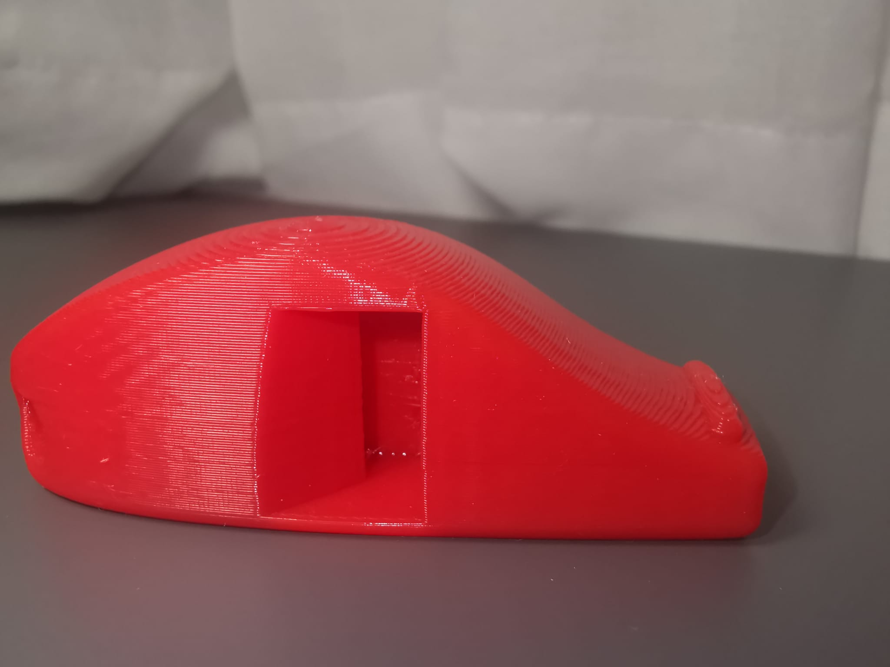

# 🛠️ Heavily Modified Ender 3 Pro Setup

---

## 🔧 Hardware Modifications

My Ender 3 Pro includes the following upgrades:

- 🧠 **Mainboard**: BTT SKR Mini E3 V2  
- 🍓 **Controller**: Raspberry Pi  
- ➖ **X Axis**: Linear Rail  
- ➖ **Y Axis**: Linear Rods  
- 📐 **Sensor**: ADXL345  
- 📍 **Auto Bed Leveling**: 3DTouch  
- 🔥 **Hotend**: Bambu-style  
- 🌬️ **Part Cooling Fan**: 5015  
- 🌡️ **Hotend Cooling Fan**: 4020  

---

## 📂 Repository Contents

- 🧾 **Klipper Configuration** (SKR Mini E3 V2 + 3DTouch + ADXL345)  
- 🖨️ **Printed Upgrade Links**  
- 🧪 **Tuning Print Models**  
- ⚙️ **Cura & PrusaSlicer Start/End G-code Templates**

---

## 🖨️ Example Prints

- 🧵 **PETG Sample**:  
  

---

## 🔌 Raspberry Pi 

- **Klipper Installation**
  [`Kiauh`](https://github.com/dw-0/kiauh)
  
- **TTY Rule (Persistent Device Name)**

To make your serial devices persist across reboots, copy this file:

📄 [`49-custom.rules`](https://gist.github.com/edro15/1c6cd63894836ed982a7d88bef26e4af)  
➡️ Place into: `/etc/udev/rules.d/`

---

## 🧱 Printed Upgrade Links

### ➖ Y-Axis Linear Rods

- [Linear Rod/Shaft Upgrade](https://www.printables.com/model/446502-ender-3-v2-x-and-y-linear-rodshaft-upgrade)  
- [Y Rod Holder + Tensioner](https://www.printables.com/model/795701-ender-3-pro-front-y-rod-holder-belt-tensioner)

### ⚙️ Belted Z-Axis

- [Belted Z Conversion](https://github.com/kevinakasam/BeltDrivenEnder3)

### 🏗️ Z-Brace for Belted Z

- [Strong Top + Z-Brace](https://www.printables.com/model/454951-strong-top-for-belt-driven-ender-3-with-z-brace)  
- [Thingiverse Z-Brace #2](https://www.thingiverse.com/thing:3719799/files) *(Use `bottom_left` and `bottom_right`)*

### ➖ X-Axis Linear Rail

- [X Linear Rail + Sherpa Mini Mount](https://www.printables.com/model/862213-ender-3-pro-x-linear-rail-and-sherpa-mini-mount)

### 💨 Fan Duct Options

- [Mini Me Remix (Height Adjustable)](https://www.printables.com/model/233046-minime-remix-height-adjustable-4010-5015-part-cool) *(Bambu hotend)*  
- [Mini Me V4 Duct](https://www.printables.com/model/197957-mini-me-v4-lightweight-ender3-hotend-duct-stock-pa) *(Stock hotend)*  
- [Volcano Nozzle Duct](https://www.thingiverse.com/thing:5141104)

### 📍 BLTouch Mounts

- [BLTouch Mount](https://www.thingiverse.com/thing:3003725)  
- [BLTouch Spacers (2mm / 5mm / 10mm)](https://www.printables.com/model/106004-bltouch-spacer-2mm5mm-and-10mmoff-brand/files)
- [ADXL345 Mount for BLTouch](https://www.printables.com/model/311258-adxl345-bltouch-mount-for-ender-3-v2)
### 🧵 Sherpa Mini Extruder

Print the parts out of **ASA**, **ABS**, or **PETG**.

- [Sherpa Mini STLs](https://github.com/Annex-Engineering/Sherpa_Mini-Extruder/tree/master/STLs)

### 🔩 X-Belt Tensioners

*Note: Only for standard Ender 3 Pro (not compatible with linear rail X-axis).*

- [Tensioner A](https://www.thingiverse.com/thing:3319649)  
- [Tensioner B](https://www.thingiverse.com/thing:3455739)

**Correct Files to Use**:
- `Ender_3_Pro_Tevo_Tornado_2mm_lower_body`  
- `ender_3_pro_tevo_tornado_x_tensioner_knob_misterguru`  
- `tensioner_slider_solid_screwheadclearance`

### 🛏️ Bed Lock

- [Bed Lock Model](https://www.printables.com/model/412791-ender-3-pro-v2-s1-ender-5-bed-lock)

### 🔇 Anti-Vibration Feet

- [Vibration-Dampening Feet](https://www.printables.com/model/385532-ender-3-pro-voron-themed-electronics-enclosure/files)

**Files to Use**:
- `foot-tpu`  
- `foot-extension`

### Y Motor Mount
- [Y Motor Mount](https://www.printables.com/model/632200-ender-3-prov2-y-axis-motor-mount)
---

## 🛒 Aliexpress Upgrade Links

- 🧲 [PEI Bed](https://tr.aliexpress.com/item/1005004992757753.html)  
- 🔥 [Hotend Upgrade – Bambu Style](https://tr.aliexpress.com/item/1005005193902909.html)  
- 🌀 [Nema14 Motor for Sherpa Mini](https://tr.aliexpress.com/item/1005002997600597.html)  
- ⚙️ [Sherpa Mini Gears & Bearings](https://tr.aliexpress.com/item/1005006023988927.html)  
- 🔩 [Bimetal Hotend for Stock Extruder](https://tr.aliexpress.com/item/1005002907726643.html)

---

## 🔧 Calibration Tools

### 🧪 Linear Advance Calibration

- [Ellis3DP Pressure Advance Tool](https://ellis3dp.com/Pressure_Linear_Advance_Tool/)

### 📏 Dimensional Accuracy

- [CaliCross](https://www.printables.com/model/546871-calicross-a-handy-tool-for-3d-printer-dimensional-)

### 🔁 Retraction Test

- [Full Retraction Test Model](https://www.printables.com/model/398911-full-retraction-test)  
  *Tip: Run tests with varied distances. Enable "Minimum travel distance for retraction".*

  

### 📦 Flow Calibration

- [Flow Cube Model](https://www.printables.com/model/81314-flow-calibration-cube/files)  
- [Slic3r Flow Math Docs](https://manual.slic3r.org/advanced/flow-math)

💡 **Pro Tip**:  
Print multiple mini parts to assess surface quality. For cubes, use fixed wall thickness over slicer auto-calculated settings.

🔍 **Slicer Differences**:
- **Cura**: Rectangular cross-sections  
- **PrusaSlicer / Slic3r**: Hemispherical logic for single-wall thickness

[🧠 Community Flow Math Deep Dive](https://community.ultimaker.com/topic/28492-flow-calculations/?do=findComment&comment=280032)

---

## 🔧 ADXL Config on SKR Mini E3 v2.0

The difference between v3.0 and 2.0  is with the accelerometer's CS pin. The V2.0 board's SPI1 port only has 6 pins, not 8, and it lacks the NSS pin. This board's connector does instead have an "RST" pin, but that's no use either

Use the EXP1 connector. You either use the lcd-board or the adxl 345 if you use the board.The alternative is to use Raspberry pi SPI pins. 

    [adxl345]
    cs_pin: PB5
    spi_software_sclk_pin: PB9
    spi_software_mosi_pin: PB8
    spi_software_miso_pin: PB15

    [resonance_tester]
    accel_chip: adxl345
    probe_points:100, 100, 20
