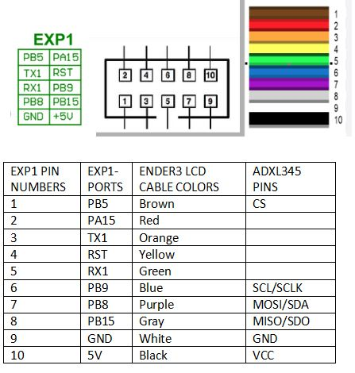

## 🔧 ADXL345 Method 1 - 1 ADXL on SKR Mini E3 v2.0

Use the EXP1 connector. You either connect the lcd-screen or the adxl 345 if you use the board.The alternative is to use Raspberry pi SPI pins. The difference between skr mini e3 v3.0 and 2.0  is with the accelerometer's CS pin. The V2.0 board's SPI1 port only has 6 pins, while 3.0 has 8, and it lacks the NSS pin. This board's connector does instead have an "RST" pin, but that's no use. It is not possible to use SPI ports for adxl345 on 2.0 unlike the 3.0. 

    [adxl345]
    cs_pin: PB5
    spi_software_sclk_pin: PB9
    spi_software_mosi_pin: PB8
    spi_software_miso_pin: PB15

    [resonance_tester]
    accel_chip: adxl345
    probe_points:100, 100, 20

If you would like to use the original ender cable to extend the pinouts from EXP1: 
  

## 🔧 ADXL345 Method 2 - 2 ADXL on Raspberry Pi

You could use spi0 and share the mosi miso and sclk with both chips and use CE0 and CE1 as ADLX345s enable pin. SPI is not designed to use 2 devices at once on the bus but the input calibration doesn't use both at the same time so this is an acceptible setup.

Configuration

    [mcu rpi]
    serial: /tmp/klipper_host_mcu
    [adxl345 hotend]
    cs_pin: rpi:None
    spi_bus: spidev0.0
    [adxl345 bed]
    cs_pin: rpi:None
    spi_bus: spidev0.1
    [resonance_tester]
    Assuming the typical setup of the bed slinger printer
    accel_chip_x: adxl345 hotend
    accel_chip_y: adxl345 bed
    probe_points:
    125,110,20 # an example

Both ADXL345's will share the same SDA, SDO and SCL, each will have their own CS pin. The config i posted above is accurate for what I'm about to list below for wiring. Remember the RPI MCU does the CS muxing so "cs_pin: rpi:None" is valid for both.

    Both
    SDA = RPI Pin 19 = GPIO10 (SPI0_MOSI)
    SDO = RPI Pin 21 = GPIO09 (SPI0_MISO)
    SCL = RPI Pin 23 = GPIO11 (SPI0_SCLK)
    3V3 (or VCC) = RPI Pin 01 = RPI Pin Name "3.3v DC power"
    GND = RPI Pin 06 = RPI Pin Name "Ground"

    ADXL345 hotend
    CS = RPI Pin 24 = GPIO08 (SPI0_CE0)

    ADXL345 bed
    CS = RPI Pin 26 = GPIO07 (SPI0_CE1)

Pins for spi reference as well as Klipper Doc [SPI Pinout](https://pinout.xyz/pinout/spi) 

Source for the information: 
- https://www.reddit.com/r/klippers/comments/qkk7un/two_adxl345s_on_one_raspberry_pi/
- https://www.reddit.com/r/klippers/comments/qkk7un/comment/hj0s9gj/ 
