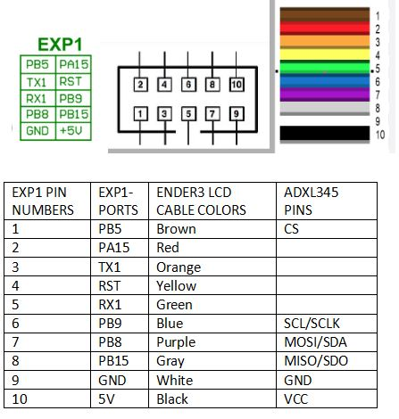

## 🔧 ADXL345on SKR Mini E3 v2.0

Use the EXP1 connector. You either connect the tft35-screen or the adxl 345 if you use the board.The alternative is to use Raspberry pi SPI pins. The difference between skr mini e3 v3.0 and 2.0  is with the accelerometer's CS pin. The V2.0 board's SPI1 port only has 6 pins, while 3.0 has 8, and it lacks the NSS pin. This board's connector does instead have an "RST" pin, but that's no use. It is not possible to use SPI ports for adxl345 on 2.0 unlike the 3.0. 

    [adxl345]
    cs_pin: PB5
    spi_software_sclk_pin: PB9
    spi_software_mosi_pin: PB8
    spi_software_miso_pin: PB15

    [resonance_tester]
    accel_chip: adxl345
    probe_points:100, 100, 20

If you would like to use the original ender cable to extend the pinouts from EXP1: 
  
