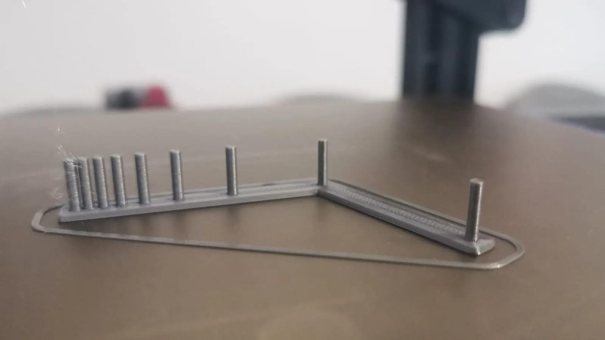

## 🔧 Calibration Tools

### 🧪 Linear Advance Calibration

- [Ellis3DP Pressure Advance Tool](https://ellis3dp.com/Pressure_Linear_Advance_Tool/)

### 📏 Dimensional Accuracy

- [CaliCross](https://www.printables.com/model/546871-calicross-a-handy-tool-for-3d-printer-dimensional-)

### 🔁 Retraction Test

- [Full Retraction Test Model](https://www.printables.com/model/398911-full-retraction-test)  
  *Tip: Run tests with varied distances. Enable "Minimum travel distance for retraction".*

  

### 📦 Flow Calibration

- [Flow Cube Model](https://www.printables.com/model/81314-flow-calibration-cube/files)  
- [Slic3r Flow Math Docs](https://manual.slic3r.org/advanced/flow-math)

💡 **Pro Tip**:  
Print multiple mini parts to assess surface quality. For cubes, use fixed wall thickness over slicer auto-calculated settings.

🔍 **Slicer Differences**:
- **Cura**: Rectangular cross-sections  
- **PrusaSlicer / Slic3r**: Hemispherical logic for single-wall thickness

[🧠 Community Flow Math Deep Dive](https://community.ultimaker.com/topic/28492-flow-calculations/?do=findComment&comment=280032)
